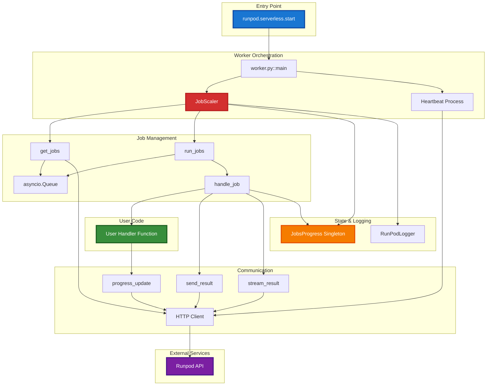
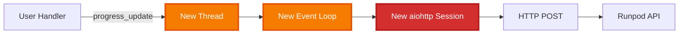
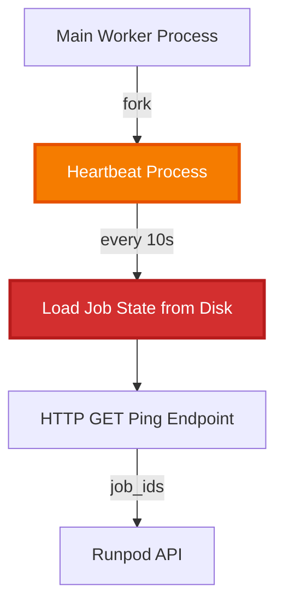
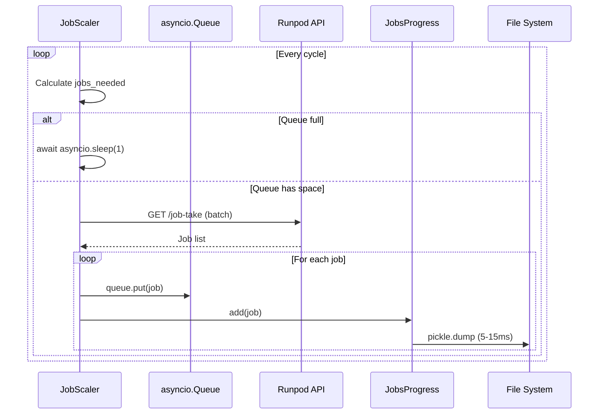
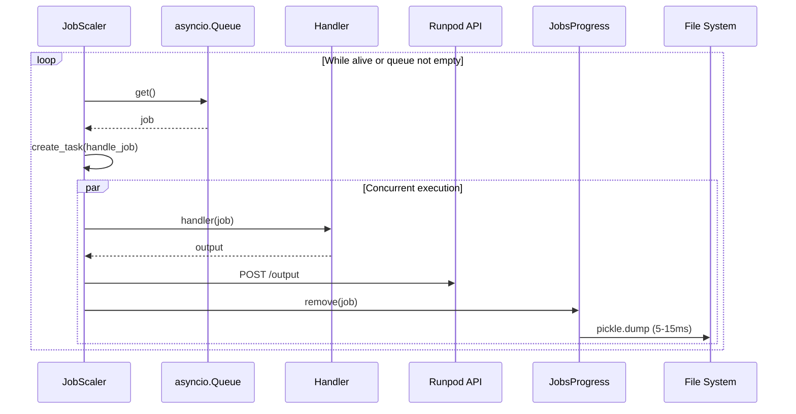
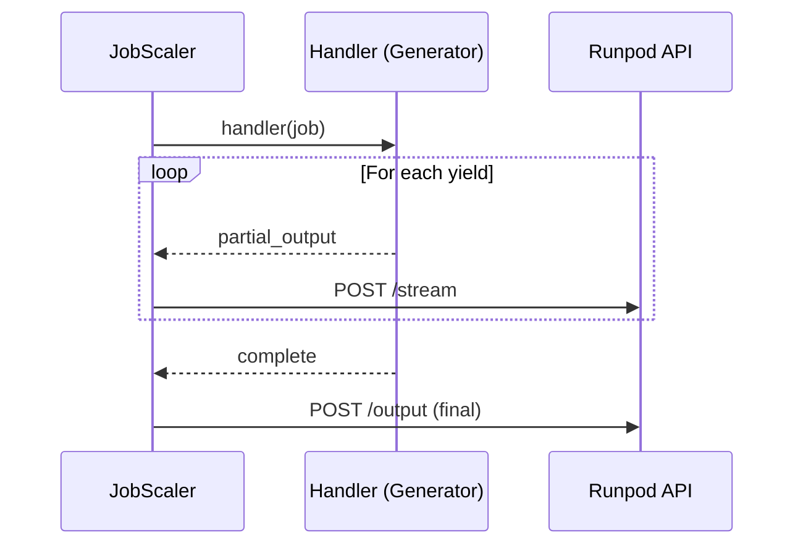
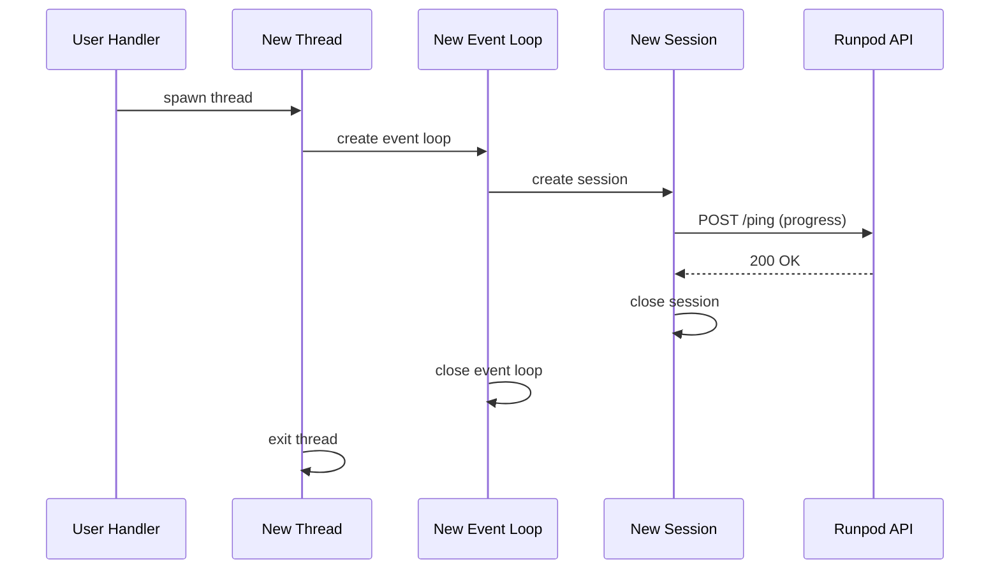
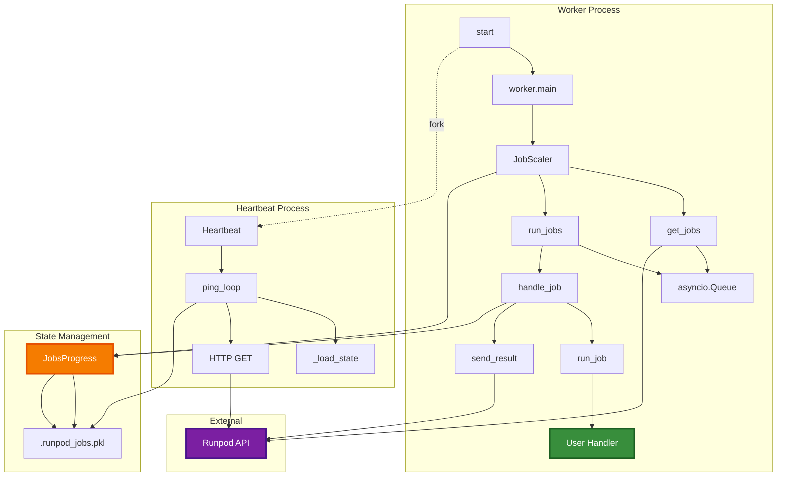
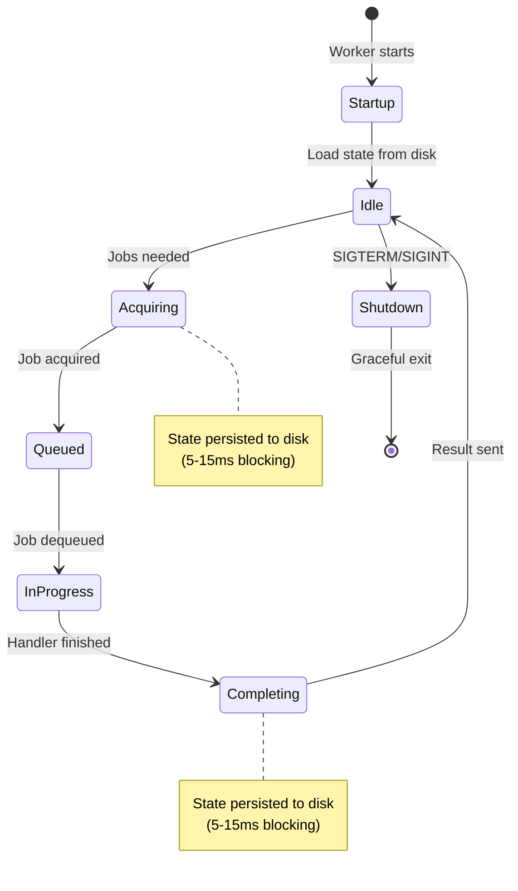

# Runpod Serverless Module Architecture

**Last Updated**: 2025-11-19
**Module**: `runpod/serverless/`
**Python Support**: 3.8-3.11

---

## Table of Contents

1. [Overview](#overview)
2. [System Architecture](#system-architecture)
3. [Component Details](#component-details)
4. [Data Flow](#data-flow)
5. [Concurrency Model](#concurrency-model)
6. [State Management](#state-management)
7. [Communication Patterns](#communication-patterns)
8. [Deployment Modes](#deployment-modes)
9. [Key Design Decisions](#key-design-decisions)
10. [Integration Points](#integration-points)
11. [Performance Characteristics](#performance-characteristics)

---

## Overview

The Runpod serverless module transforms a container into a worker pod for the Runpod serverless platform. It provides a framework for executing user-defined handler functions in response to job requests from the Runpod API.

### Purpose

- Execute user-defined functions as serverless workers
- Manage job lifecycle from acquisition to completion
- Handle concurrent job processing with configurable scaling
- Provide local development environment with FastAPI server
- Support both synchronous and asynchronous handlers
- Enable streaming results for generator functions

### Core Responsibilities

1. **Job Acquisition**: Poll Runpod API for available jobs
2. **Job Processing**: Execute user handler with job input
3. **Result Transmission**: Send outputs back to Runpod API
4. **Heartbeat Management**: Signal worker availability
5. **State Persistence**: Track in-progress jobs across restarts
6. **Error Handling**: Capture and report handler exceptions

---

## System Architecture



### High-Level Flow

1. **Initialization**: `start()` parses arguments, configures worker
2. **Mode Selection**: Routes to local testing, realtime API, or production worker
3. **Worker Loop**: JobScaler manages job acquisition and processing
4. **Concurrent Execution**: Multiple jobs processed simultaneously
5. **Graceful Shutdown**: Signal handlers ensure clean termination

---

## Component Details

### Entry Point: `__init__.py`

**Location**: `runpod/serverless/__init__.py`

**Responsibilities**:
- Parse command-line arguments (log level, serve API, test input, etc.)
- Configure logging based on runtime arguments
- Detect deployment mode (local vs production vs realtime)
- Initialize and start appropriate worker mode
- Register signal handlers (SIGTERM, SIGINT)

**Key Functions**:
- `start(config)`: Main entry point for starting worker
- `_set_config_args(config)`: Parse and apply runtime arguments
- `_signal_handler(sig, frame)`: Graceful shutdown on signals

**Configuration Schema**:
```python
config = {
    "handler": Callable,                    # User-defined handler function
    "rp_args": {
        "rp_log_level": str,                # ERROR, WARN, INFO, DEBUG
        "rp_debugger": bool,                # Enable debugger output
        "rp_serve_api": bool,               # Start local FastAPI server
        "rp_api_port": int,                 # FastAPI port (default: 8000)
        "rp_api_host": str,                 # FastAPI host (default: localhost)
        "rp_api_concurrency": int,          # FastAPI workers (default: 1)
        "test_input": dict,                 # Local test job input
    },
    "concurrency_modifier": Callable,       # Dynamic concurrency adjustment
    "refresh_worker": bool,                 # Kill worker after job completion
    "return_aggregate_stream": bool,        # Aggregate streaming outputs
    "reference_counter_start": float,       # Performance benchmarking timestamp
}
```

---

### Worker Orchestration: `worker.py`

**Location**: `runpod/serverless/worker.py`

**Responsibilities**:
- Route to appropriate execution mode
- Start heartbeat process for production workers
- Initialize JobScaler for job management

**Key Functions**:
- `main(config)`: Entry point after argument parsing
- `run_worker(config)`: Start production worker loop
- `_is_local(config)`: Determine if running locally

**Execution Paths**:
1. **Local Mode**: `test_input` provided or no `RUNPOD_WEBHOOK_GET_JOB` env var
2. **Production Mode**: Environment variables set, no test input

---

### Job Scaling: `modules/rp_scale.py`

**Location**: `runpod/serverless/modules/rp_scale.py`

**Responsibilities**:
- Manage concurrent job execution
- Adjust concurrency dynamically via modifier function
- Coordinate job acquisition and processing tasks
- Handle graceful shutdown with signal handlers

**Class**: `JobScaler`

**Attributes**:
```python
current_concurrency: int               # Current max concurrent jobs
jobs_queue: asyncio.Queue             # Pending jobs awaiting execution
job_progress: JobsProgress            # Singleton tracking active jobs
concurrency_modifier: Callable        # Function to adjust concurrency
_shutdown_event: asyncio.Event        # Graceful shutdown signal
```

**Key Methods**:
- `start()`: Entry point - registers signal handlers and starts event loop
- `run()`: Main async loop coordinating get_jobs and run_jobs tasks
- `get_jobs(session)`: Continuously fetch jobs from Runpod API
- `run_jobs(session)`: Process jobs from queue concurrently
- `handle_job(session, job)`: Execute individual job with error handling
- `set_scale()`: Apply concurrency modifier and resize queue
- `handle_shutdown(signum, frame)`: Signal handler for graceful termination

**Concurrency Control**:
- Jobs queue size matches current concurrency limit
- Dynamic scaling requires draining queue (blocking operation)
- Task management via `asyncio.wait` with `FIRST_COMPLETED`

**Error Handling**:
- `TooManyRequests`: 5-second backoff
- `TimeoutError`: Retry job acquisition (90s timeout)
- `Exception`: Log error, continue processing

---

### Job Operations: `modules/rp_job.py`

**Location**: `runpod/serverless/modules/rp_job.py`

**Responsibilities**:
- Fetch jobs from Runpod API
- Execute user handler functions
- Handle both standard and generator functions
- Aggregate streaming outputs if configured
- Attach debugger information when enabled

**Key Functions**:

#### `get_job(session, num_jobs)`
Fetch jobs from job-take API (legacy single or batch mode).

**Behavior**:
- HTTP GET to `RUNPOD_WEBHOOK_GET_JOB` endpoint
- Append `batch_size` parameter for batch requests
- Include `job_in_progress` flag indicating active jobs
- Return `None` on 204 (no jobs), 400 (FlashBoot enabled)
- Raise `TooManyRequests` on 429 status
- Parse JSON response into job list

**Response Handling**:
```python
# Legacy: {"id": "...", "input": {...}}
# Batch: [{"id": "...", "input": {...}}, ...]
```

#### `handle_job(session, config, job)`
Main job processing orchestrator.

**Flow**:
1. Detect if handler is generator via `is_generator(handler)`
2. **Generator Path**: Stream outputs via `run_job_generator`
3. **Standard Path**: Execute via `run_job`
4. Attach debugger output if `rp_debugger` flag set
5. Send result via `send_result`

#### `run_job(handler, job)`
Execute synchronous or async handler.

**Behavior**:
- Invoke handler with job dict
- Await result if handler returns awaitable
- Extract error/refresh_worker from output dict
- Validate return size via `check_return_size`
- Capture exceptions with traceback, hostname, worker_id, version

**Output Format**:
```python
# Success
{"output": <handler_return>}

# Error
{"error": json.dumps({
    "error_type": str,
    "error_message": str,
    "error_traceback": str,
    "hostname": str,
    "worker_id": str,
    "runpod_version": str
})}

# Stop pod
{"output": {...}, "stopPod": True}
```

#### `run_job_generator(handler, job)`
Execute generator handler for streaming output.

**Behavior**:
- Detect async vs sync generator via `inspect.isasyncgenfunction`
- Yield each partial output as `{"output": <partial>}`
- Handle errors mid-stream with `{"error": "..."}`
- Log each streamed partial

---

### State Management: `modules/worker_state.py`

**Location**: `runpod/serverless/modules/worker_state.py`

**Responsibilities**:
- Track jobs currently in progress
- Persist state across worker restarts
- Provide singleton interface for job tracking

**Constants**:
- `WORKER_ID`: Pod ID from env or generated UUID
- `REF_COUNT_ZERO`: Benchmark timestamp for debugger
- `IS_LOCAL_TEST`: Boolean flag for local execution

**Class**: `Job`

Simple dataclass representing a job with `id`, `input`, `webhook`.

**Class**: `JobsProgress(Set[Job])`

Singleton set subclass with persistent file-based storage.

**Storage Mechanism**:
- File: `.runpod_jobs.pkl` in current working directory
- Format: Pickle serialized set
- Locking: `FileLock` prevents concurrent access
- Persistence: Every add/remove triggers save

**Key Methods**:
```python
add(job)           # Add job to set, persist to disk
remove(job)        # Remove job from set, persist to disk
get_job_list()     # Return comma-separated job IDs
get_job_count()    # Return number of active jobs
_save_state()      # Serialize set to pickle file with lock
_load_state()      # Deserialize set from pickle file with lock
```

**Performance Characteristics**:
- **Write Latency**: 5-15ms per add/remove (includes pickle + file I/O + lock)
- **Read Latency**: 5-10ms for load (includes unpickle + file I/O + lock)
- **Frequency**: Every job acquisition and completion (high frequency)

**Known Issues**:
- Blocking file I/O on every operation (see TODO.md P0)
- Singleton reloads state on `get_job_list()` unnecessarily
- File locking contention under high concurrency

---

### HTTP Communication: `modules/rp_http.py`

**Location**: `runpod/serverless/modules/rp_http.py`

**Responsibilities**:
- Send job results to Runpod API
- Stream partial results for generator functions
- Retry failed transmissions with exponential backoff

**Endpoints**:
- `RUNPOD_WEBHOOK_POST_OUTPUT`: Final job results
- `RUNPOD_WEBHOOK_POST_STREAM`: Streaming partial outputs

**Key Functions**:

#### `_transmit(client_session, url, job_data)`
Low-level POST with retry logic.

**Retry Strategy**:
- Algorithm: Fibonacci backoff (1s, 1s, 2s)
- Attempts: 3 retries
- Library: `aiohttp-retry` with `FibonacciRetry`

**Request Format**:
```python
headers = {
    "charset": "utf-8",
    "Content-Type": "application/x-www-form-urlencoded"
}
data = json.dumps(job_data, ensure_ascii=False)
```

#### `send_result(session, job_data, job, is_stream=False)`
Send final job result to `POST_OUTPUT` endpoint.

#### `stream_result(session, job_data, job)`
Send partial result to `POST_STREAM` endpoint.

**Error Handling**:
- `ClientError`: Log and swallow (non-blocking)
- `TypeError/RuntimeError`: Log and swallow
- Always mark job finished on `JOB_DONE_URL` completion

---

### Progress Updates: `modules/rp_progress.py`

**Location**: `runpod/serverless/modules/rp_progress.py`

**Responsibilities**:
- Allow user handlers to report progress
- Send progress updates to Runpod API asynchronously

**Key Function**: `progress_update(job, progress)`

**Architecture**:


**Current Implementation**:
1. Spawn daemon thread for each progress update
2. Create new event loop in thread
3. Create new aiohttp session
4. POST to `RUNPOD_WEBHOOK_PING` endpoint
5. Close session and event loop

**Performance Characteristics**:
- Thread creation overhead: ~1-2ms
- Event loop creation: ~1ms
- Session creation: ~2-5ms
- Total latency: ~5-20ms per update
- No connection reuse

**Known Issues** (see TODO.md P2):
- Thread spawn overhead on every update
- No session pooling
- Event loop creation inefficiency

---

### Heartbeat: `modules/rp_ping.py`

**Location**: `runpod/serverless/modules/rp_ping.py`

**Responsibilities**:
- Signal worker availability to Runpod platform
- Report in-progress jobs
- Enable platform to track worker health

**Class**: `Heartbeat`

Singleton managing separate multiprocessing.Process for pinging.

**Architecture**:


**Key Methods**:
```python
start_ping()           # Fork process and start ping loop
ping_loop()            # Infinite loop sending pings every PING_INTERVAL
_send_ping()           # Load job state, construct URL, HTTP GET
```

**Ping Mechanism**:
- **Interval**: 10 seconds (configurable via `RUNPOD_PING_INTERVAL`)
- **HTTP Method**: GET with query parameters
- **Timeout**: 2x interval (20s default)
- **Job State**: Reads from `.runpod_jobs.pkl` every ping

**Query Parameters**:
```python
{
    "job_id": "comma,separated,ids",
    "retry_ping": "1"  # if previous ping failed
}
```

**Performance Characteristics**:
- Memory: Full process duplication (~50-200MB depending on imports)
- File I/O: Reads job state every 10 seconds
- HTTP: Synchronous `requests` library (blocking)

**Known Issues** (see TODO.md P1):
- Separate process causes memory duplication
- File I/O every ping instead of shared memory
- Synchronous HTTP blocks process
- No backoff on repeated failures

---

### Local Development: `modules/rp_fastapi.py`

**Location**: `runpod/serverless/modules/rp_fastapi.py`

**Responsibilities**:
- Provide local HTTP API for testing handlers
- Simulate Runpod job execution environment
- Enable development without Runpod platform

**Class**: `WorkerAPI`

FastAPI application wrapping user handler.

**Endpoints**:
- `POST /runsync`: Execute handler synchronously, return output
- `POST /run`: Execute handler asynchronously, return job ID
- `GET /status/{job_id}`: Check async job status
- `POST /stream/{job_id}`: Streaming output (generator handlers)

**Usage**:
```bash
python worker.py --rp_serve_api --rp_api_port 8000 --rp_api_host localhost
```

**Request Format**:
```json
{
    "input": {
        "prompt": "...",
        "params": "..."
    }
}
```

**Response Format**:
```json
{
    "id": "job-uuid",
    "status": "IN_QUEUE | IN_PROGRESS | COMPLETED | FAILED",
    "output": {...}
}
```

**Features**:
- Job queue simulation
- In-memory job tracking
- Automatic job ID generation
- Handler error capture
- Generator streaming support

---

### Logging: `modules/rp_logger.py`

**Location**: `runpod/serverless/modules/rp_logger.py`

**Responsibilities**:
- Structured logging with job context
- Configurable log levels
- Consistent log formatting

**Class**: `RunPodLogger`

Wrapper around Python `logging` module with job ID context.

**Log Methods**:
```python
log.debug(message, job_id=None)
log.info(message, job_id=None)
log.warn(message, job_id=None)
log.error(message, job_id=None)
```

**Output Format**:
```
[TIMESTAMP] [LEVEL] [job_id] message
```

**Configuration**:
- Set via `--rp_log_level` argument or `set_level()` method
- Levels: DEBUG, INFO, WARN, ERROR
- Default: INFO

---

### Utilities

#### `utils/rp_cleanup.py`
Cleanup resources after job execution (temp files, GPU memory).

#### `utils/rp_cuda.py`
CUDA availability detection and GPU utilization tracking.

#### `utils/rp_debugger.py`
Collect debugging information (versions, environment, performance metrics).

#### `utils/rp_download.py`
Download files from URLs for job input preprocessing.

#### `utils/rp_upload.py`
Upload files to S3 for job output storage.

#### `utils/rp_validator.py`
Validate job input against schema.

#### `utils/rp_model_cache.py`
Manage model caching for faster job startup.

---

## Data Flow

### Job Acquisition Flow



### Job Processing Flow



### Streaming Output Flow



### Progress Update Flow



---

## Concurrency Model

### Event Loop Architecture

**Single Event Loop**: All async operations run on main event loop.

**Concurrent Tasks**:
1. **Job Acquisition** (`get_jobs`): Continuously fetch jobs from API
2. **Job Processing** (`run_jobs`): Process jobs from queue concurrently

**Task Coordination**:
```python
async def run():
    async with AsyncClientSession() as session:
        jobtake_task = asyncio.create_task(get_jobs(session))
        jobrun_task = asyncio.create_task(run_jobs(session))
        await asyncio.gather(jobtake_task, jobrun_task)
```

### Concurrency Control

**Mechanisms**:
1. **Queue Size**: `asyncio.Queue(maxsize=current_concurrency)`
2. **Task Management**: `asyncio.wait(..., return_when=FIRST_COMPLETED)`
3. **Shutdown Event**: `asyncio.Event` for graceful termination

**Dynamic Scaling**:
```python
async def set_scale():
    new_concurrency = concurrency_modifier(current_concurrency)

    # Wait for queue to drain before resizing
    while current_occupancy() > 0:
        await asyncio.sleep(1)

    self.jobs_queue = asyncio.Queue(maxsize=new_concurrency)
```

**Limitations**:
- Scaling requires complete queue drain (blocking)
- 1-second polling granularity
- Cannot scale up immediately under load

### Handler Execution

**Synchronous Handler**:
```python
def handler(job):
    # Runs on event loop thread (blocking)
    result = compute(job["input"])
    return {"output": result}
```

**Async Handler**:
```python
async def handler(job):
    # Non-blocking async execution
    result = await async_compute(job["input"])
    return {"output": result}
```

**Generator Handler**:
```python
def handler(job):
    # Streaming results
    for i in range(10):
        yield {"partial": i}
```

**Async Generator Handler**:
```python
async def handler(job):
    # Async streaming results
    async for item in async_iterator():
        yield {"partial": item}
```

### Threading Model

**Main Thread**: Event loop execution, job processing

**Separate Process**: Heartbeat (multiprocessing.Process)

**Ephemeral Threads**: Progress updates (threading.Thread per update)

---

## State Management

### In-Memory State

**JobScaler**:
- `jobs_queue`: asyncio.Queue of pending jobs
- `current_concurrency`: int tracking max concurrent jobs
- `_shutdown_event`: asyncio.Event for graceful shutdown

**JobsProgress Singleton**:
- Set of active Job objects
- Loaded from disk on initialization
- Synchronized to disk on every add/remove

### Persistent State

**File**: `.runpod_jobs.pkl`

**Format**: Pickle serialized `set[Job]`

**Locking**: FileLock prevents concurrent access

**Purpose**:
- Survive worker restarts
- Report in-progress jobs to platform
- Prevent duplicate job execution

**Synchronization Points**:
1. Worker startup: Load from disk
2. Job acquisition: Add to set, write to disk
3. Job completion: Remove from set, write to disk
4. Heartbeat: Read from disk every 10s

### Environment Variables

**Required**:
- `RUNPOD_WEBHOOK_GET_JOB`: Job acquisition endpoint
- `RUNPOD_WEBHOOK_POST_OUTPUT`: Result submission endpoint

**Optional**:
- `RUNPOD_WEBHOOK_POST_STREAM`: Streaming output endpoint
- `RUNPOD_WEBHOOK_PING`: Heartbeat endpoint
- `RUNPOD_POD_ID`: Worker identifier
- `RUNPOD_POD_HOSTNAME`: Pod hostname
- `RUNPOD_PING_INTERVAL`: Heartbeat interval (default: 10s)
- `RUNPOD_REALTIME_PORT`: Port for realtime API mode
- `RUNPOD_REALTIME_CONCURRENCY`: Concurrency for realtime mode

---

## Communication Patterns

### HTTP Client Configuration

**Library**: `aiohttp` with speedups

**Session Management**:
```python
class AsyncClientSession(aiohttp.ClientSession):
    def __init__(self):
        connector = aiohttp.TCPConnector(limit=0)  # Unlimited connections
        super().__init__(connector=connector)
```

**Retry Strategy** (via `aiohttp-retry`):
- Algorithm: Fibonacci backoff (1s, 1s, 2s, 3s, 5s...)
- Attempts: 3 retries
- Applies to: Result transmission

### API Endpoints

#### Job Acquisition
```
GET {RUNPOD_WEBHOOK_GET_JOB}?job_in_progress={0|1}
GET {RUNPOD_WEBHOOK_GET_JOB}/batch?batch_size={N}&job_in_progress={0|1}
```

**Response**: `{"id": "...", "input": {...}}` or `[{...}, {...}]`

#### Result Submission
```
POST {RUNPOD_WEBHOOK_POST_OUTPUT}?id={job_id}&isStream={true|false}
Content-Type: application/x-www-form-urlencoded

{"output": {...}} or {"error": "..."}
```

#### Streaming Output
```
POST {RUNPOD_WEBHOOK_POST_STREAM}?id={job_id}&isStream=true
Content-Type: application/x-www-form-urlencoded

{"output": {...}}
```

#### Heartbeat
```
GET {RUNPOD_WEBHOOK_PING}?job_id={comma_separated_ids}&retry_ping={0|1}
```

#### Progress Update
```
POST {RUNPOD_WEBHOOK_PING}
Content-Type: application/json

{"job_id": "...", "progress": {...}}
```

### Error Responses

**429 Too Many Requests**: Worker backs off for 5 seconds

**204 No Content**: No jobs available (normal)

**400 Bad Request**: FlashBoot enabled (expected)

**4xx/5xx**: Logged, request retried with exponential backoff

---

## Deployment Modes

### Production Mode

**Trigger**: `RUNPOD_WEBHOOK_GET_JOB` environment variable set

**Behavior**:
1. Start heartbeat process
2. Initialize JobScaler with production configuration
3. Enter infinite loop fetching and processing jobs
4. Respond to SIGTERM/SIGINT for graceful shutdown

**Command**:
```bash
python worker.py
```

### Local Testing Mode

**Trigger**: `--test_input` argument provided

**Behavior**:
1. Create mock job from test input
2. Execute handler with mock job
3. Print output to stdout
4. Exit after completion

**Command**:
```bash
python worker.py --test_input '{"prompt": "test"}'
```

### Local API Mode

**Trigger**: `--rp_serve_api` argument

**Behavior**:
1. Start FastAPI server on specified host/port
2. Expose HTTP endpoints for handler execution
3. Simulate Runpod job environment
4. Useful for development and debugging

**Command**:
```bash
python worker.py --rp_serve_api --rp_api_port 8000 --rp_api_host localhost
```

### Realtime Mode

**Trigger**: `RUNPOD_REALTIME_PORT` environment variable set

**Behavior**:
1. Start FastAPI server on specified port
2. Bind to 0.0.0.0 for external access
3. Use realtime concurrency configuration
4. Similar to local API but for production use

**Environment**:
```bash
export RUNPOD_REALTIME_PORT=8000
export RUNPOD_REALTIME_CONCURRENCY=4
python worker.py
```

---

## Key Design Decisions

### 1. Asyncio Event Loop

**Decision**: Use single asyncio event loop for all async operations.

**Rationale**:
- Efficient I/O multiplexing for HTTP requests
- Native support for concurrent task management
- Compatible with aiohttp library

**Tradeoffs**:
- Synchronous handlers block event loop
- Requires careful mixing of sync/async code
- File I/O blocks event loop (current limitation)

### 2. File-Based State Persistence

**Decision**: Persist job state to pickle file on disk.

**Rationale**:
- Survive worker restarts
- Simple implementation without external dependencies
- File locking prevents corruption

**Tradeoffs**:
- Blocking I/O on every job add/remove (5-15ms)
- Lock contention under high concurrency
- Not suitable for multi-worker scenarios

**Alternative Considered**: Redis (deferred for simplicity)

### 3. Separate Heartbeat Process

**Decision**: Use multiprocessing.Process for heartbeat.

**Rationale**:
- Isolate blocking HTTP from main event loop
- Ensure heartbeat continues during handler execution
- Simple process management

**Tradeoffs**:
- Full memory duplication (~50-200MB)
- Inter-process communication via file system
- Cannot share in-memory job state

**Alternative Considered**: Async task (see TODO.md P1)

### 4. Progress Updates via Threading

**Decision**: Spawn thread for each progress update.

**Rationale**:
- Non-blocking for user handler
- Simple API: `progress_update(job, data)`
- No shared state concerns

**Tradeoffs**:
- Thread creation overhead (~1-2ms per update)
- Event loop creation per thread (~1ms)
- New HTTP session per update (no pooling)

**Alternative Considered**: Async queue with worker task (see TODO.md P2)

### 5. Dynamic Queue Resizing

**Decision**: Require full queue drain before resizing.

**Rationale**:
- Simplifies queue replacement logic
- Prevents race conditions with in-flight jobs
- asyncio.Queue doesn't support live resizing

**Tradeoffs**:
- Cannot scale up immediately under load
- 1-second polling until queue drains
- Delays scaling response time

**Alternative Considered**: Semaphore-based concurrency control (see TODO.md P2)

### 6. Lazy Loading Dependencies

**Decision**: Lazy import heavy libraries (boto3, fastapi, pydantic).

**Rationale**:
- Reduce cold start time by 32-42%
- Only load dependencies when needed
- Improves worker startup latency

**Implementation** (commit cc05a5b):
```python
# Before
import boto3
import fastapi

# After
def use_boto():
    import boto3  # Lazy load only when needed
```

**Impact**: 32-42% reduction in cold start time

### 7. Handler Flexibility

**Decision**: Support sync, async, generator, and async generator handlers.

**Rationale**:
- Accommodate diverse use cases
- Enable streaming outputs for LLMs
- Backward compatibility with sync code

**Implementation**:
```python
if is_generator(handler):
    async for output in run_job_generator(handler, job):
        await stream_result(session, output, job)
else:
    result = await run_job(handler, job)
    await send_result(session, result, job)
```

---

## Integration Points

### User Handler Contract

**Function Signature**:
```python
def handler(job: dict) -> dict:
    """
    Args:
        job: {
            "id": str,              # Unique job identifier
            "input": dict,          # User-provided input
            "webhook": str,         # Optional webhook URL
        }

    Returns:
        dict: {
            "output": Any,          # Job output (serializable to JSON)
            "error": str,           # Optional error message
            "refresh_worker": bool, # Optional flag to kill worker
        }
    """
```

**Async Handler**:
```python
async def handler(job: dict) -> dict:
    # Async operations allowed
    result = await async_compute()
    return {"output": result}
```

**Generator Handler**:
```python
def handler(job: dict) -> Generator[dict, None, None]:
    for i in range(10):
        yield {"partial": i}
```

**Error Handling**:
```python
def handler(job: dict) -> dict:
    try:
        result = compute()
        return {"output": result}
    except Exception as e:
        return {"error": str(e)}
```

### Runpod API Contract

**Job Acquisition**:
- Method: GET
- Blocking: Yes (long-polling)
- Timeout: 90 seconds
- Response: JSON job object or empty

**Result Submission**:
- Method: POST
- Format: application/x-www-form-urlencoded
- Retry: 3 attempts with Fibonacci backoff
- Response: 200 OK (ignored)

**Streaming Output**:
- Method: POST
- Format: application/x-www-form-urlencoded
- Frequency: Per generator yield
- Response: 200 OK (ignored)

**Heartbeat**:
- Method: GET
- Frequency: Every 10 seconds
- Parameters: job_id (comma-separated), retry_ping
- Response: 200 OK (ignored)

### Environment Variable Contract

**Required for Production**:
```bash
RUNPOD_WEBHOOK_GET_JOB="https://api.runpod.io/v2/.../job-take/$ID"
RUNPOD_WEBHOOK_POST_OUTPUT="https://api.runpod.io/v2/.../job-done/$ID"
```

**Optional**:
```bash
RUNPOD_WEBHOOK_POST_STREAM="https://api.runpod.io/v2/.../stream/$ID"
RUNPOD_WEBHOOK_PING="https://api.runpod.io/v2/.../ping"
RUNPOD_POD_ID="worker-12345"
RUNPOD_POD_HOSTNAME="worker-12345.runpod.io"
RUNPOD_PING_INTERVAL="10"
```

---

## Performance Characteristics

### Latency Budget

**Job Acquisition**:
- HTTP request: 1-5s (long-polling)
- State persistence: 5-15ms (pickle + file I/O)
- Queue insertion: <1ms (asyncio.Queue)
- **Total**: 1-5s per batch

**Job Processing**:
- Handler execution: Variable (user code)
- Result serialization: 1-10ms (json.dumps)
- Result transmission: 50-500ms (HTTP POST with retry)
- State persistence: 5-15ms (pickle + file I/O)
- **Total**: Handler time + 60-525ms overhead

**Heartbeat**:
- State load: 5-10ms (unpickle + file I/O)
- HTTP GET: 10-100ms
- **Frequency**: Every 10s
- **Impact**: Minimal (separate process)

**Progress Update**:
- Thread spawn: 1-2ms
- Event loop creation: 1ms
- Session creation: 2-5ms
- HTTP POST: 50-200ms
- **Total**: 55-210ms per update

### Throughput

**Theoretical Maximum**:
- Concurrency: Configurable (default: 1)
- Jobs per second: Concurrency / (handler_time + 0.5s)
- Example: 10 concurrent, 5s handler → 2 jobs/second

**Bottlenecks**:
1. File I/O on every job add/remove (5-15ms)
2. Heartbeat process memory overhead
3. Progress update threading overhead
4. Queue resize blocking

**Optimization Opportunities** (see TODO.md):
- In-memory state with async checkpointing (+50-70% throughput)
- Event-based job queue (+10-15% CPU efficiency)
- Async heartbeat task (-20-30% memory)
- Unified progress queue (+30-40% progress latency)

### Resource Usage

**Memory**:
- Base worker: 50-100MB
- Heartbeat process: +50-200MB (duplicated memory)
- Per job: 1-100MB (depends on handler)
- Progress threads: ~8MB per thread (ephemeral)

**CPU**:
- Job acquisition polling: 1-2% (1s sleep interval)
- Heartbeat: <1% (10s interval)
- Handler execution: Variable (user code)

**Disk I/O**:
- Job state writes: 2x per job (add + remove)
- Heartbeat reads: Every 10s
- Total: ~20-40 ops/minute at 10 jobs/min

**Network**:
- Job acquisition: Continuous long-polling
- Result submission: 1-2 requests per job
- Streaming: N requests per generator job
- Heartbeat: 1 request per 10s

---

## Diagrams

### Component Interaction



### State Lifecycle



---

## References

- Main worker loop: `runpod/serverless/worker.py`
- Job scaling: `runpod/serverless/modules/rp_scale.py`
- Job operations: `runpod/serverless/modules/rp_job.py`
- State management: `runpod/serverless/modules/worker_state.py`
- HTTP communication: `runpod/serverless/modules/rp_http.py`
- Heartbeat: `runpod/serverless/modules/rp_ping.py`
- Progress updates: `runpod/serverless/modules/rp_progress.py`
- Local API: `runpod/serverless/modules/rp_fastapi.py`

**Performance analysis**: See [TODO.md](TODO.md)

**Recent optimizations**: Commit cc05a5b (lazy loading, -32-42% cold start)

---

**Document Version**: 1.0
**Last Updated**: 2025-11-19
